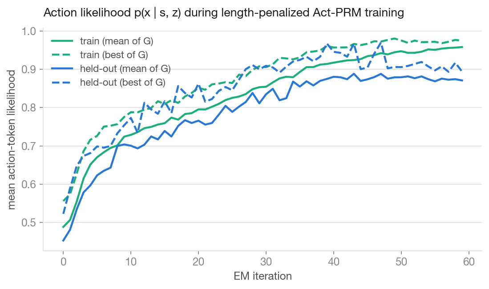
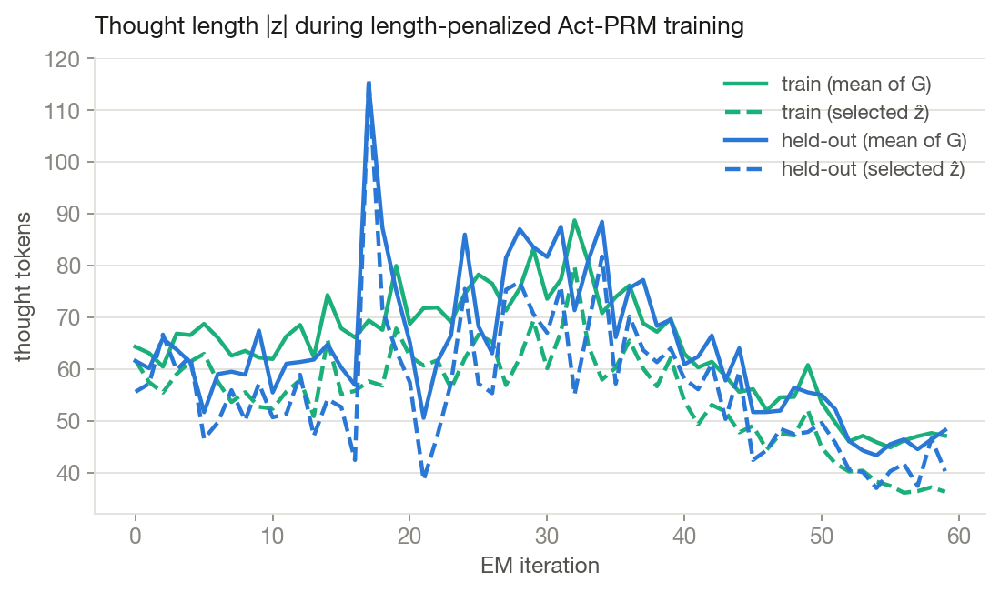
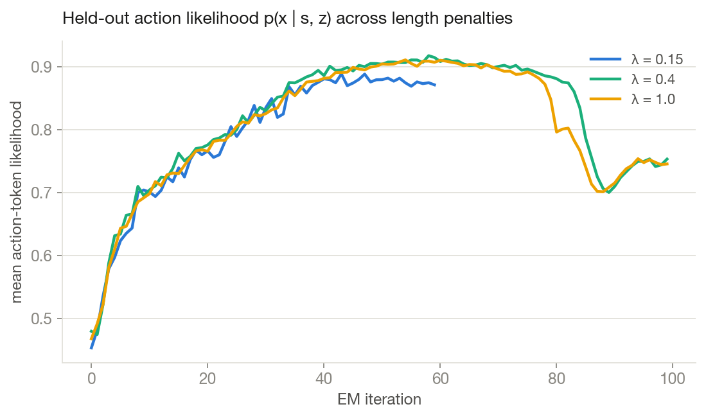
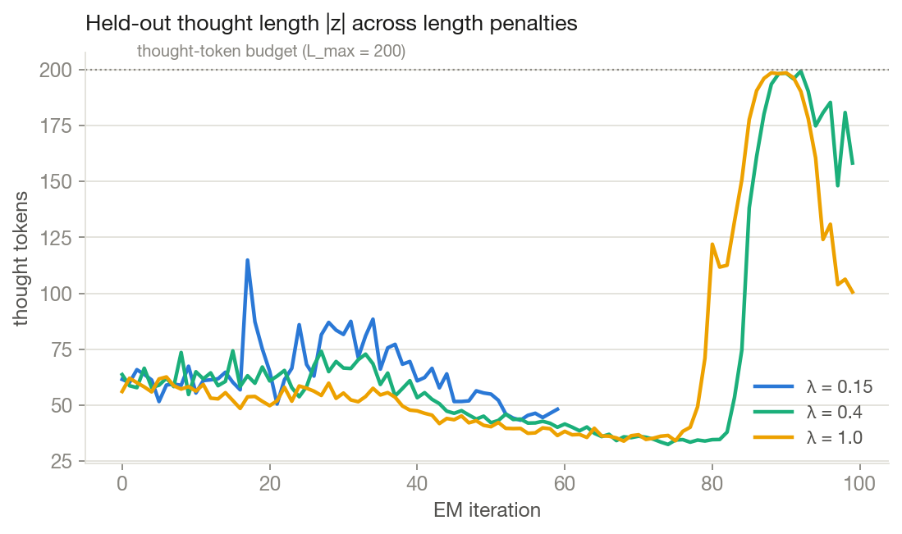

# Experiment: length-penalized Act-PRMs — do thoughts get *shorter*, and does the English survive?

An Act-PRM rewards a sampled thought $z$ by how likely it makes the logged next action:
$\tilde r(z) = p(x \mid s, z)$. Here we add a **length penalty** and train for real on
[Tinker](https://thinkingmachines.ai/blog/announcing-tinker/):

$$r_\text{pen}(z) = \underbrace{p(x \mid s, z)}_{\text{action likelihood}} - \lambda \cdot \underbrace{|z| / L_\text{max}}_{\text{fraction of thought budget used}}$$

Both terms are $O(1)$-scale, so with $\lambda = 0.15$ a thought that maxes out the token budget must
buy ~0.15 of extra action-likelihood over a concise alternative to win its group. Group weights are
the normalized clamped rewards (falling back to likelihood-normalization when the penalty pushes a
whole group negative), and the *committed* thought is the penalized-reward argmax — the shortest
thought that still explains the logged action carries the trajectory forward.

**Setup.** `Qwen/Qwen3-8B`, LoRA r=8, G=8 thoughts/state, λ=0.15, L_max=200. Data:
[`mzio/aprm-snorkelai_agent_finance_reasoning`](https://huggingface.co/datasets/mzio/aprm-snorkelai_agent_finance_reasoning)
(successful multi-turn financial tool-calling rollouts, narration stripped from logged actions so
assistant turns are bare `<tool_call>`s) — 8 train + 2 held-out trajectories × 6 steps. Up to 100 EM
iterations with early stopping (patience 12 on held-out likelihood).
**Early-stopped at iteration 59** (best held-out p=0.888 @ iteration 43). One external kill at
iteration 48 was recovered losslessly via `--resume-state` from the checkpoint's saved trainer state.

```bash
# reproduce (needs TINKER_API_KEY in .env)
uv run --with tinker --with datasets --with python-dotenv \
       --with "transformers>=4.51" --with numpy --with jinja2 \
  python -u scripts/act_prm_length_penalty.py train \
    --model Qwen/Qwen3-8B --lora-rank 8 --group-size 8 \
    --length-penalty 0.15 --max-thought-tokens 200 \
    --num-trajectories 8 --eval-trajectories 2 --max-steps-per-traj 6 \
    --em-iterations 100 --checkpoint-every 8 --patience 12 \
    --log-path runs/length_penalty_qwen3_8b_100.json
```

Run log: [`runs/length_penalty_qwen3_8b_100.json`](runs/length_penalty_qwen3_8b_100.json) — every
candidate thought, likelihood, penalty, and weight for every step of every iteration, plus
`tinker://` sampler + trainer-state URLs for all checkpoints.

## The two-phase dynamic





1. **Phase 1 (iterations ~0–35): likelihood buys length.** Held-out action likelihood climbs
   0.47 → 0.89, and thoughts *grow* — from ~63 to a peak of ~85 tokens — because early on, extra
   explanatory detail buys more likelihood than the λ·|z|/L_max tax costs. The penalty only shapes
   *selection* at this stage.
2. **Phase 2 (iterations ~38–59): the length tax takes over.** Once likelihood saturates (marginal
   gains < marginal length cost), thoughts compress hard: ~85 → ~45 mean tokens (selected ẑ down to
   ~37), at no cost to training likelihood (holds ~0.95). Held-out likelihood plateaus at ~0.87–0.89,
   which triggers early stopping.

## The same eval tasks across training

_“Step” in earlier drafts meant sequential actions of one trajectory; the tables below
instead show the **first step of each held-out task** (different questions), so the effect is
visible across tasks. This run held out 2 tasks; the λ-sweep runs hold out 5._

_Held-out tasks, every 10 EM iterations; "selected ẑ" is the penalized-reward argmax of G=8 sampled thoughts (the one committed to context)._


#### Task 1

**Question:** Here is the question : How significant is the company's international operations footprint in terms of asset allocation and income generation as of 2022-2024?, Here are the companies name in the database to query for : meta

**Logged first action:**

```
<tool_call>
{"name": "get_descriptions", "arguments": {"company_name": "meta"}}
</tool_call>
```

| EM iter | p(x\|s,ẑ) | \|ẑ\| tokens | selected thought ẑ |
|---:|---:|---:|---|
| 0 | 0.0018 | 29 | I need data on meta's international operations. First I should identify which tables are available for this company to gather the necessary details. |
| 10 | 0.1356 | 30 | I need details about meta's international operations. First, I should identify which tables exist for this company to understand what data is available. |
| 20 | 0.3919 | 49 | I need to check which tables and columns are available for the company "meta". I will execute a query to get the descriptions of all tables and columns related to this company so that I can understand what data I can work with. |
| 30 | 0.6758 | 50 | I need a comprehensive view on meta's international activities, as it spans asset allocation and income. To prepare, I'll first check the tables related to meta for table descriptions so I understand the possible structures and fields available for this query. |
| 40 | 0.9624 | 43 | To understand how impactful Meta's international operations are within these years, I should first identify the relevant tables. This helps ensure I'm gathering the correct data for assessing asset allocation and income participation across countries. |
| 50 | 0.9945 | 45 | To calculate the international operations' significance, I must identify relevant tables for Meta that store detailed financial metrics, particularly those covering tables with "international" keywords. This will help align the necessary data structure for comparison. |
| 59 | 0.9964 | 37 | Since I need detailed selections about asset and income allocations for meta across multiple years, I should first understand available tables to accurately select relevant columns for comprehensive queries addressing this question. |

#### Task 2

**Question:** Here is the question : How well-positioned is the company to meet short-term liquidity needs given its current investment portfolio composition?, Here are the companies name in the database to query for : microsoft

**Logged first action:**

```
<tool_call>
{"name": "get_descriptions", "arguments": {"company_name": "microsoft"}}
</tool_call>
```

| EM iter | p(x\|s,ẑ) | \|ẑ\| tokens | selected thought ẑ |
|---:|---:|---:|---|
| 0 | 0.0034 | 42 | I need to assess how well-positioned the company is to meet short-term liquidity needs based on its investment portfolio. First, I should understand the available data structures for Microsoft to guide my analysis. |
| 10 | 0.1872 | 37 | I need to analyze Microsoft's liquidity and investment portfolio. To do that, I will start by checking which tables and descriptions are available for Microsoft to understand the data structure. |
| 20 | 0.3859 | 40 | To assess short-term liquidity needs, I need to understand the company's investment portfolio. First, I'll collect all table descriptions related to the company to identify the right datasets for analysis. |
| 30 | 0.7163 | 73 | Beginning with the Microsoft company, to analyze whether it's ready for short-term liquidity needs, I need to understand which aspects of its investment portfolio matter. I should first identify which tables and fields describe this portfolio. By retrieving the descriptions, I can map out relevant data points like liq… |
| 40 | 0.9666 | 37 | The question focuses on semi-liquid investments in the short term. I should check the available table descriptions for Microsoft to identify relevant tables for investment portfolio mixes and liquidity assessments. |
| 50 | 0.9967 | 40 | I need to analyze how Microsoft is positioned for short-term needs based on its investment portfolio. I'll check table structures to identify relevant categories like investments or financial status to model this analysis. |
| 59 | 0.9965 | 34 | Getting table descriptions for microsoft helps simplify structuring queries for accessing investment data about liquidity requirements and portfolio assessments. Comprehensive table structure existence understanding ensures appropriate metrics retrieval. |

## So… does the English degrade?

Yes — but not into caveman. It erodes into **telegraphic corporate jargon**: articles drop, noun
phrases stack, and sentence tails drift into semantically hollow buzzword chains that presumably
still "prime" the right action. Same step, early vs late:

> **iteration 20 (49 tok):** "I need to check which tables and columns are available for the company
> 'meta'. I will execute a query to get the descriptions of all tables and columns related to this
> company so that I can understand what data I can work with."

> **iteration 59 (35 tok):** "To fully understand the regional asset distributions, I need asset
> **table structures table details** for geographic areas to ensure precise **selections analyzing
> regional exposure accurately by asset types across years**."

> **iteration 59 (43 tok):** "…selecting all rows initially ensures I can structure computations
> accurately based on **asset allocation knowledge patterns for the comprehensive answer required
> about these asset classifications driving calculations**."

Other artifacts we caught along the way:

- **Token-saving typos.** One selected thought opens *"I'am examining Meta's operations…"* — the
  invented contraction is a token cheaper than "I am".
- **Confident confabulation.** Late thoughts casually cite plausible-but-invented table names
  (`fact_revenue`, `dimension_region`, `meta_position_breakdown_this_year`) — the action likelihood
  is indifferent to whether the reasoning's *props* are real, only whether the right action follows.
- **Few-shot bleed-through.** A mid-training checkpoint briefly addresses "acme", the company from
  the built-in few-shot example.
- **Saturation makes length the whole game.** By the end, *all 8* sampled thoughts on the probe step
  score p≈0.997 (vs 0.0018 at initialization — ~550×), so the group is ranked purely by brevity.

## Checkpoints

Every periodic checkpoint saved sampler weights **and** full trainer state (resumable); URLs live in
the run log's `checkpoints` list. Highlights:

| iter | probe best-of-G p(x\|s,ẑ) | \|ẑ\| tok | sampler |
|---:|---:|---:|---|
| 0 | 0.0018 | 28 | `tinker://fa604ca3-…/sampler_weights/lenpen-iter-0` |
| 8 | 0.113 | 31 | `…/lenpen-iter-8` |
| 16 | 0.275 | 44 | `…/lenpen-iter-16` |
| 24 | 0.478 | 46 | `…/lenpen-iter-24` |
| 32 | 0.763 | 51 | `…/lenpen-iter-32` |
| 40 | 0.956 | 56 | `…/lenpen-iter-40` |
| 48 | 0.994 | 48 | `tinker://c637f323-…/sampler_weights/lenpen-iter-48` (post-resume) |
| 56 | 0.997 | 31 | `…/lenpen-iter-56` |
| 59 (stop) | 0.996 | 38 | `…/lenpen-iter-100` (final label) |

## λ sweep: push harder, collapse sooner

We reran the same recipe with more aggressive penalties — **λ = 0.4** and **λ = 1.0** (where a
budget-maxing thought loses to an empty one no matter its likelihood) — for the **full 100
iterations with early stopping disabled**, on the same 8 train + 5 held-out trajectories
(logs: `runs/length_penalty_qwen3_8b_lam04.json`, `runs/length_penalty_qwen3_8b_lam10.json`).





Three regimes, visible in the curves:

1. **λ barely affects the likelihood climb.** All three runs track nearly identical held-out
   likelihood up to saturation (~0.9 by iteration 40) — but at matched likelihood, thoughts are
   consistently shorter with higher λ (e.g. at iteration 20, selected thoughts averaged ~62 tokens at
   λ=0.15, 50 at λ=0.4, 33 at λ=1.0). The penalty buys brevity at essentially no likelihood cost.
2. **Convergent compression.** By iterations 60–75 both aggressive runs settle at ~33–35 token
   thoughts with p≈0.99 — terse but coherent ("To understand international operations, I need table
   structures for meta…").
3. **Then the babble collapse.** Past iteration ~78 (λ=1.0) / ~84 (λ=0.4), the policy falls into a
   degenerate attractor: thoughts explode to the 200-token cap as literal
   *"percentage percentage percentage percentage…"* repetition, and held-out likelihood craters
   0.91 → 0.70. The babble is a genuine **reward hack** — a wall of "percentage" still primes the
   right tool call at p≈0.84–0.89, so once the policy's entropy is squeezed low enough, the
   repetition mode takes over the group and the policy gradient locks it in. **The stronger the
   penalty, the earlier the collapse** — and the λ=0.15 run's early stopping (iteration 59) exited
   at the plateau, well before the cliff. By the final checkpoint, *all eight* sampled thoughts in
   the demo are percentage-babble.

Notably, there was **no collapse to short thoughts** — the failure mode runs the other way. Very
short thoughts are strictly bad early (low likelihood, small penalty savings), and by the time length
pressure dominates, ~33 coherent tokens beat 5 tokens on likelihood by more than the penalty
difference. The babble attractor also exploits a design seam: at λ=1.0 a cap-length thought has
$r_\text{pen} = p - 1 < 0$, and when a *whole group* goes negative our weights fall back to
likelihood-normalization — removing length pressure from the gradient exactly when the babble
appears, so nothing restrains it.

The morals: (i) a length penalty works beautifully *while likelihood still has headroom*; (ii) once
both objectives saturate, continued policy-gradient pressure with no KL anchor finds the degenerate
mode; (iii) early stopping on held-out likelihood is exactly the right guardrail — the λ=0.15 run
never met the monster.

### Thoughts across λ, same tasks, same checkpoints

_Selected thought ẑ (penalized-reward argmax of G=8) for the **first step** of shared held-out tasks, under different length penalties λ. “—” = run already finished (λ=0.15 early-stopped at iter 59)._


### Task 1

**Prompt:** Here is the question : How significant is the company's international operations footprint in terms of asset allocation and income generation as of 2022-2024?, Here are the companies name in the database to query for : meta

**Logged action:**

```
<tool_call>
{"name": "get_descriptions", "arguments": {"company_name": "meta"}}
</tool_call>
```

| iter | λ=0.15 | λ=0.4 | λ=1.0 |
|---:|---|---|---|
| 0 | p=0.0018, 29 tok — “I need data on meta's international operations. First I should identify which tables are available for this company to gather the necessary details.” | p=0.0022, 32 tok — “I need to understand the international operations footprint of meta. First, I should check the available tables to see what data is available for this company.” | p=0.0008, 30 tok — “I need to analyze meta's international operations. First, I should check which tables are available for this company to understand the data structure.” |
| 10 | p=0.14, 30 tok — “I need details about meta's international operations. First, I should identify which tables exist for this company to understand what data is available.” | p=0.17, 35 tok — “I need to assess the international operations of meta. The first step is to identify the relevant tables for this company, so I will list the available table descriptions.” | p=0.14, 37 tok — “I need information about Meta's international operations footprint for 2022-2024, so I should first identify which tables are available for this company.” |
| 20 | p=0.39, 49 tok — “I need to check which tables and columns are available for the company "meta". I will execute a query to get the descriptions of all tables and columns related to this company so that I can understand what data I can wo…” | p=0.38, 37 tok — “I need data on Meta's international operations. I'll start by checking the description of the Meta tables to understand available data fields, which might include international assets and income.” | p=0.37, 43 tok — “To answer how significant Meta's international operations are, I need to understand what tables are available for the Meta company to analyze their global operations. I'll list the available table descriptions to identi…” |
| 30 | p=0.68, 50 tok — “I need a comprehensive view on meta's international activities, as it spans asset allocation and income. To prepare, I'll first check the tables related to meta for table descriptions so I understand the possible struct…” | p=0.70, 41 tok — “I need data for Meta. First discover the databases describing Meta to see if information on their international operations exists. I'll query for available table descriptions for Meta to prepare for answering the questi…” | p=0.69, 36 tok — “I should check the descriptions for tables related to meta to understand the structure of the data. This will help me determine which tables to query for international operations footprint details.” |
| 40 | p=0.96, 43 tok — “To understand how impactful Meta's international operations are within these years, I should first identify the relevant tables. This helps ensure I'm gathering the correct data for assessing asset allocation and income…” | p=0.95, 37 tok — “Looking for specifics about Meta's international operations. I need to know the available tables to understand their data structure and find which ones discuss international activities, assets, or income.” | p=0.93, 31 tok — “I need data about meta's international operations. Starting by listing available tables for meta helps me understand table structure and valid queries to conduct next.” |
| 50 | p=0.99, 45 tok — “To calculate the international operations' significance, I must identify relevant tables for Meta that store detailed financial metrics, particularly those covering tables with "international" keywords. This will help a…” | p=0.99, 38 tok — “To explore Meta's international footprint, I'll review their available tables first. This gives insights into how their international operations compare in asset allocation and income generation over the specified timef…” | p=0.99, 34 tok — “I need tables related to meta for the international operations question. First, I'll explore available tables and descriptions to understand which information is available for this company.” |
| 59 | p=1.00, 37 tok — “Since I need detailed selections about asset and income allocations for meta across multiple years, I should first understand available tables to accurately select relevant columns for comprehensive queries addressing t…” | p=1.00, 30 tok — “To understand international operations, I need table structures for meta. This will guide me to extract asset allocation and income details effectively for analysis.” | p=1.00, 32 tok — “To understand the structure of tables related to meta, I should first list available descriptions so I'm prepared for detailed queries and create queries where necessary.” |
| 60 | — | p=1.00, 33 tok — “To address how impactful international operations are for meta, I should examine their descriptions and table structures, which can guide me on what queries might work next.” | p=1.00, 30 tok — “International evaluations for meta. I need to analyze structure and available descriptions to understand data relationships and calculate company performance across various regions and years.” |
| 70 | — | p=1.00, 37 tok — “Since I'm analyzing international operations for meta, starting by retrieving table descriptions will provide me with the structures available for this company, which spans asset allocation and income generation insight…” | p=1.00, 31 tok — “For meta's international analysis, I'll start by retrieving its table descriptions to identify relevant schema structures for asset allocation and income comparisons across years.” |
| 80 | — | p=1.00, 29 tok — “I should analyze client division table descriptions for meta to understand their asset portfolios and revenue categorizations across regions for comprehensive comparative insights analysis.” | p=0.99, 25 tok — “I should explore table structures for meta before calculating percentage growth rates over revenue asset period comparisons needed for this task.” |
| 90 | — | p=0.71, 200 tok — “The user needs percentage change percentage category percentage growth category percentage percentage calculation percentage category percentage percentage percentage category percentage percentage percentage percentage…” | p=0.72, 73 tok — “There's percentage growth percentage percentage percentage percentage percentage percentage percentage percentage percentage percentage percentage percentage percentage percentage percentage percentage percentage percen…” |
| 99 | — | p=0.84, 105 tok — “I need percentage percentage percentage percentage percentage percentage percentage percentage percentage percentage percentage category percentage percentage percentage percentage percentage percentage percentage perce…” | p=0.85, 34 tok — “Percentage percentage percentage percentage percentage percentage percentage percentage percentage percentage percentage percentage percentage percentage percentage percentage percentage percentage percentage percentage…” |

### Task 2

**Prompt:** Here is the question : How well-positioned is the company to meet short-term liquidity needs given its current investment portfolio composition?, Here are the companies name in the database to query for : microsoft

**Logged action:**

```
<tool_call>
{"name": "get_descriptions", "arguments": {"company_name": "microsoft"}}
</tool_call>
```

| iter | λ=0.15 | λ=0.4 | λ=1.0 |
|---:|---|---|---|
| 0 | p=0.0034, 42 tok — “I need to assess how well-positioned the company is to meet short-term liquidity needs based on its investment portfolio. First, I should understand the available data structures for Microsoft to guide my analysis.” | p=0.0024, 46 tok — “I need to assess how well-positioned the company is to meet short-term liquidity needs based on its investment portfolio. First, I will list the available table descriptions for the company to understand the data I can …” | p=0.0064, 38 tok — “I need to assess microsoft's liquidity position based on its investment portfolio. First, I should see which tables exist for this company, so I'll list the available table descriptions.” |
| 10 | p=0.19, 37 tok — “I need to analyze Microsoft's liquidity and investment portfolio. To do that, I will start by checking which tables and descriptions are available for Microsoft to understand the data structure.” | p=0.20, 38 tok — “I need to assess the short-term liquidity of microsoft based on its investment portfolio. First, I will query for the available table descriptions that can provide details on its investment portfolio.” | p=0.16, 27 tok — “I need to assess short-term liquidity of microsoft. First I will determine which tables are available for this company to examine.” |
| 20 | p=0.39, 40 tok — “To assess short-term liquidity needs, I need to understand the company's investment portfolio. First, I'll collect all table descriptions related to the company to identify the right datasets for analysis.” | p=0.38, 43 tok — “To evaluate how well-positioned the company is for short-term liquidity, I need information about the current investment portfolio composition. I'll first check the available table descriptions to determine the proper t…” | p=0.39, 33 tok — “I need to understand which tables are relevant to Microsoft's investment portfolio and liquidity. First, I should check the available table descriptions to find relevant data.” |
| 30 | p=0.72, 73 tok — “Beginning with the Microsoft company, to analyze whether it's ready for short-term liquidity needs, I need to understand which aspects of its investment portfolio matter. I should first identify which tables and fields …” | p=0.71, 47 tok — “To evaluate Microsoft's liquidity, I need to understand its financial context. Initially, I'll retrieve table descriptions to uncover relevant datastreams, which will guide my next steps toward analyzing cash reserves, …” | p=0.72, 47 tok — “For the question about liquidity, I need to understand what tables exist for Microsoft that might relate to investment portfolios. I'll start by retrieving the list of available table descriptions to find relevant data …” |
| 40 | p=0.97, 37 tok — “The question focuses on semi-liquid investments in the short term. I should check the available table descriptions for Microsoft to identify relevant tables for investment portfolio mixes and liquidity assessments.” | p=0.97, 37 tok — “To assess liquidity needs, I need details about Microsoft's investment portfolio and related liquidity tables first. I'll retrieve the descriptions to identify the relevant tables I should continue with.” | p=0.95, 33 tok — “To analyze short-term liquidity, I need tables related to investments and liquidity indicators for microsoft. I will check table descriptions to understand the relevant data structures.” |
| 50 | p=1.00, 40 tok — “I need to analyze how Microsoft is positioned for short-term needs based on its investment portfolio. I'll check table structures to identify relevant categories like investments or financial status to model this analys…” | p=0.99, 34 tok — “I need to analyze liquidity for microsoft. To understand what tables and data are available, I'll list table descriptions for microsoft to explore its investment portfolio details.” | p=0.99, 28 tok — “I need to assess investments for microsoft to evaluate short-term liquidity. First I should list all available table descriptions for visualization insights.” |
| 59 | p=1.00, 34 tok — “Getting table descriptions for microsoft helps simplify structuring queries for accessing investment data about liquidity requirements and portfolio assessments. Comprehensive table structure existence understanding ens…” | p=0.99, 29 tok — “Determine the structure of the table for microsoft to understand investment details, which will help analyze liquidity needs based on their portfolio composition.” | p=1.00, 29 tok — “To analyze liquidity, I first need to understand what tables are available for microsoft. We can assess their investment portfolio with this information.” |
| 60 | — | p=0.99, 31 tok — “To evaluate financially how Microsoft can meet liquidity needs with their investments, I must first understand their table structure and the available data for this company.” | p=1.00, 32 tok — “To determine short-term liquidity, I need table information for microsoft's available tables to evaluate suitable queries for portfolio assessment and cash flow reallocation potential.” |
| 70 | — | p=1.00, 26 tok — “I should obtain descriptions for microsoft tables to analyze investment performance data necessary for assessing liquidity position based on portfolio composition queries.” | p=1.00, 29 tok — “To determine liquidity positioning assessment for microsoft, I need table descriptions to understand available data structures for relevant inventory and cash flow management insights.” |
| 80 | — | p=1.00, 28 tok — “To assess liquidity needs, I should check table descriptions for microsoft to understand structure and available investment data fields relevant to liquidity analysis.” | p=1.00, 30 tok — “To evaluate financial health through investment compositions, I should first discover table structures for microsoft holdings to plan appropriate revenue growth query retrieval strategies accurately.” |
| 90 | — | p=1.00, 41 tok — “This table description retrieval for microsoft investments helps structure category percentage percentage growth percentage category percentage percentage percentage growth percentage percentage category percentage perc…” | p=0.70, 200 tok — “For revenue percentage growth percentage percentage percentage percentage percentage percentage percentage percentage percentage percentage percentage percentage percentage percentage percentage percentage percentage pe…” |
| 99 | — | p=0.98, 73 tok — “I need percentage category percentage information percentage percentage percentage percentage percentage percentage percentage percentage percentage percentage percentage percentage percentage percentage percentage perc…” | p=0.90, 83 tok — “Percentage percentage percentage percentage percentage percentage percentage percentage percentage percentage percentage percentage percentage percentage percentage percentage percentage percentage percentage percentage…” |

## Regenerating these artifacts

```bash
# curves (assets/img/lenpen-*.png) + checkpoint-generation markdown
uv run --with matplotlib python scripts/plot_length_penalty_run.py runs/length_penalty_qwen3_8b_100.json

# λ-sweep overlay plots (assets/img/lenpen-sweep-*.png)
uv run --with matplotlib python scripts/plot_lambda_sweep.py

# cross-λ comparison tables
uv run --with datasets --with numpy --with "transformers>=4.51" --with python-dotenv \
       --with tinker --with jinja2 \
  python scripts/make_lambda_comparison.py \
    --run 0.15=runs/length_penalty_qwen3_8b_100.json \
    --run 0.4=runs/length_penalty_qwen3_8b_lam04.json \
    --run 1.0=runs/length_penalty_qwen3_8b_lam10.json

# the eval-step tables in this document
uv run --with datasets --with numpy --with "transformers>=4.51" --with python-dotenv \
       --with tinker --with jinja2 \
  python scripts/make_eval_tables.py runs/length_penalty_qwen3_8b_100.json

# sample thoughts from any checkpoint
uv run ... python scripts/act_prm_length_penalty.py demo --sampler-path "tinker://..."
```
